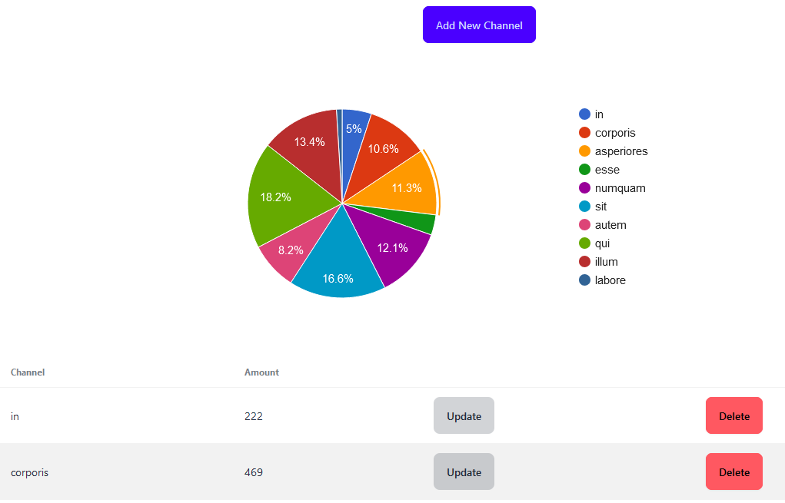
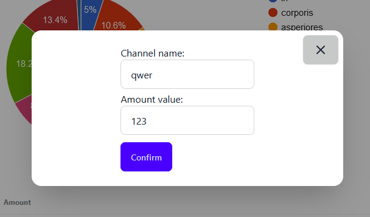
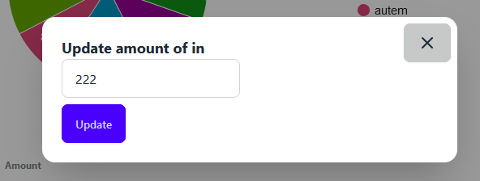
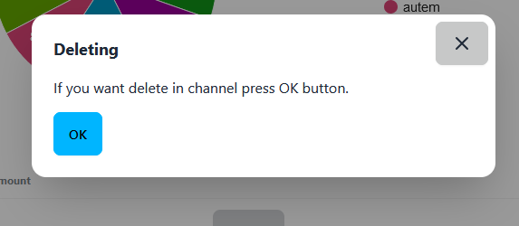
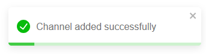

## Command to launch the application ##
`npm run build && php artisan serve`

## Command to run tests in Laravel ##
Tests are in the folder **tests**.
- unit tests
  `php artisan test --testsuite=Unit`

- 'integration' test
  `php artisan test --filter AcquisitionChannelIntegrationTest`

## Command to run tests in React ##
Tests for React are in the folder **tests-react**, which is in **react** folder.

Instead of *file_name*, enter the name of the file with the selected test.

`npm test file_name.test.tsx`

## Backend ##
### Used: ###
- PHP 8.3.4
- Laravel 11
- database: SQLite

### Done on the backend ###
- added model and controller for AcquisitionChannel
- added custom request for data validation
- added factory and seeder to fill table **acquisition_channels** in database

## Frontend ##
### Used: ###
- React and react-dom version: ^18
- TypeScript 5.4.5
- tailwindcss ^3.4.13 and library daisyUI ^4.12.22
- react-google-charts ^5.2.1
- jest ^29.7.0

## App ##

The main application window is presented above.

The adding and updating forms have field validation added.
Thanks to this, the user cannot, for example, enter a negative number or string in the amount field.
If the data is incorrect, an appropriate message will appear under the given
field and the button will be unavailable/impossible to click.

When the user clicks the delete button, a window will appear asking if he
or she really wants to delete the channel. If the user is sure of this, the given channel will be deleted after 
clicking the "OK" button.

Each action: adding, updating or deleting a channel results in displaying a notification in the upper right corner
that the action was a success/error.

